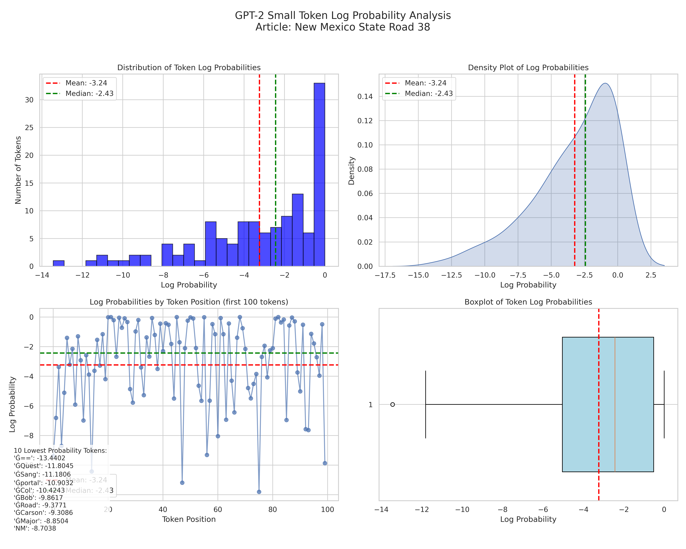
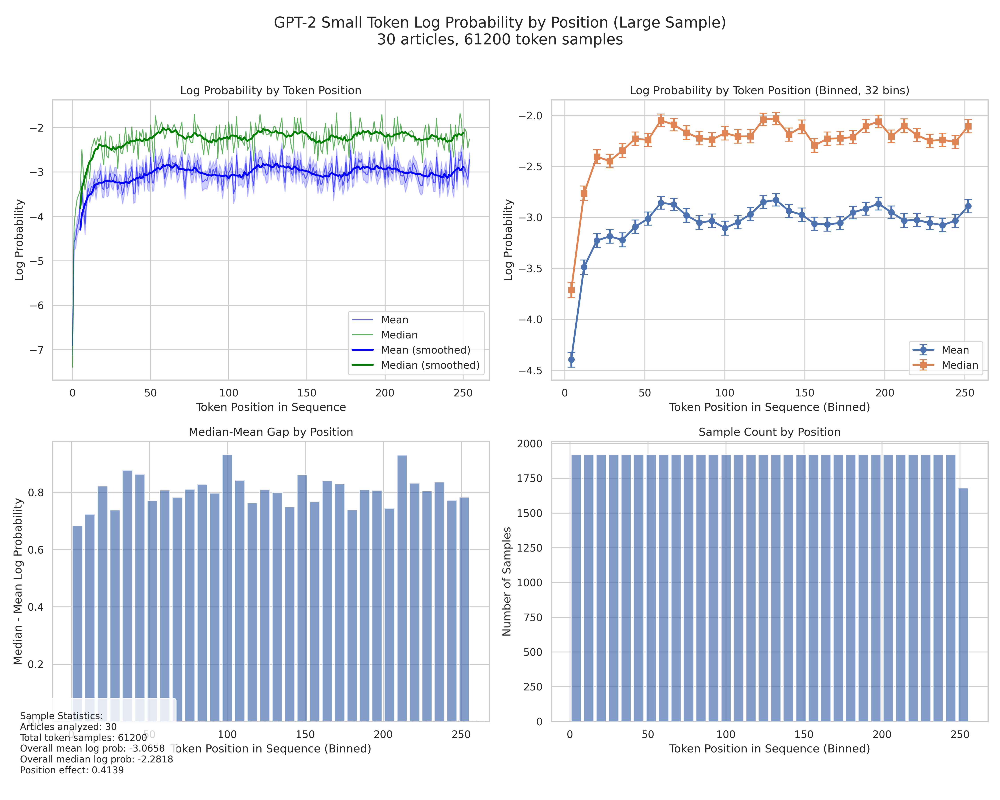
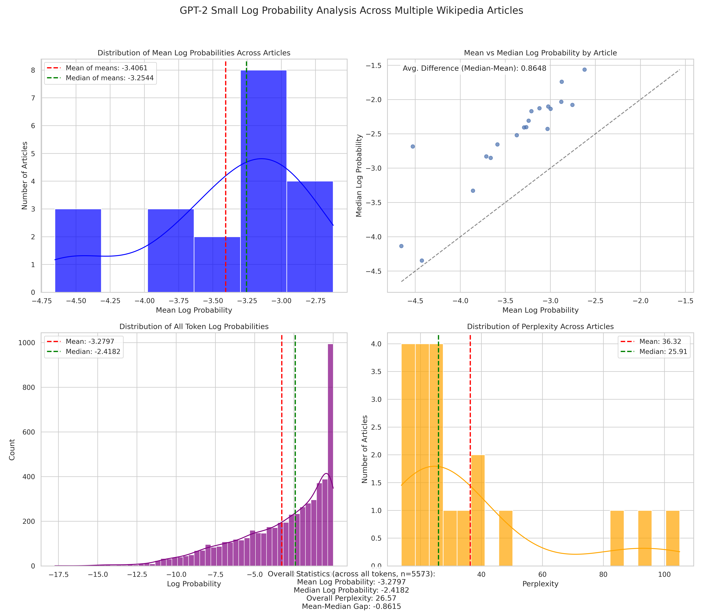

# GPT-2 Token Probability Analysis

This repository contains a collection of scripts for analyzing token log probabilities in OpenAI's GPT-2 small language model. The analysis examines how token probabilities are distributed, how they vary by position within the context window, and how they differ across various Wikipedia articles.

## Key Findings

### 1. Mean vs. Median Log Probabilities

We found a consistent gap between the mean and median log probabilities of tokens:

- **Mean log probability**: around -3.06 to -3.40 (varies by sample)
- **Median log probability**: around -2.20 to -2.50 (varies by sample)
- **The gap**: approximately 0.8 in log probability space

This gap exists because the distribution of token log probabilities is highly skewed - most tokens have relatively high probability, but a smaller number of "surprising" tokens have very low probability.



### 2. Position Effect in Context Window

A robust finding across multiple analyses is that token position within the context window has a significant effect on log probability:

- **First ~40 tokens**: Much lower log probability (around -4.40 at position 0)
- **After position ~50**: Stabilizes around -3.0 (mean) and -2.2 (median)
- **Improvement**: 34.3% from first position to later positions

This suggests that GPT-2 struggles when starting from scratch but quickly improves as context accumulates.



### 3. Variation Across Articles

Different Wikipedia articles showed substantial variation in their average log probabilities:

- **Most predictable articles**: Simple topics with common vocabulary (e.g., "U.S. National Water Ski Championships")
- **Least predictable articles**: Articles with rare words, proper nouns, or specialized vocabulary (e.g., "Tramteatret", "Masarguppi")
- **Perplexity range**: From ~14 to ~105 (lower is more predictable)



## Practical Implications

1. **Perplexity Calculation**: Average perplexity is heavily influenced by the presence of rare, unpredictable tokens.

2. **Position Awareness**: Any evaluation of GPT-2 should account for position effects, as the first ~40-50 tokens have systematically lower probabilities.

3. **Median as Alternative Metric**: The median log probability might be a more stable measure of model performance since it's less affected by outlier tokens.

4. **Warm-up Period**: GPT-2 needs ~40-50 tokens of "warm-up" to reach its peak performance.

## Scripts in this Repository

- `check_gpt2_prob.py`: Basic script to check GPT-2 log probabilities on a single Wikipedia article
- `plot_gpt2_probs.py`: Creates detailed visualizations of token probability distributions
- `analyze_multiple_articles.py`: Analyzes log probabilities across multiple Wikipedia articles
- `analyze_position_effects.py`: Small-scale analysis of how probabilities vary by position
- `position_analysis_large_sample.py`: Large-scale analysis of positional effects across 30 articles

## Usage

Prerequisites:
```bash
pip install transformers torch numpy wikipedia matplotlib seaborn pandas tqdm
```

To run the basic probability check:
```bash
python check_gpt2_prob.py
```

To analyze positional effects across a large sample:
```bash
python position_analysis_large_sample.py
```

## Dataset

All analyses in this repository use random Wikipedia articles accessed through the `wikipedia` Python library. This provides a diverse set of text across various topics.

## Technical Details

- All analyses use GPT-2 small (117M parameters) from Hugging Face transformers
- Token probabilities are calculated using the model's next-token prediction loss
- Log probabilities are natural logarithms (base e)
- Perplexity is calculated as exp(-mean_log_prob)

## License

MIT

## Citation

If you find this analysis useful, please cite:
```
@misc{gpt2probanalysis,
  author = {Scott Viteri},
  title = {GPT-2 Token Probability Analysis},
  year = {2025},
  publisher = {GitHub},
  url = {https://github.com/scottviteri/gpt2-token-probabilities-analysis}
}
```
